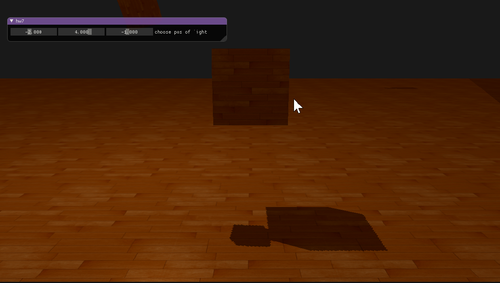

<h2>2019 CG Homework 7</h2>

# Homework 7 实验报告

*16340063 巩泽群*

## 实现效果




## Shadow mapping 原理概述

拿官网的图来说话，通过如图的方式，通过在目标绘制点和光源之间画一条线，如果之间有遮挡物那么就说明这个点应该被绘制为阴影，图中黑色的片段即需要被渲染为阴影的部分。


如果从目标点出发，计算这个黑色部分的值需要大量的计算。从光源出发，同时追踪所有射线上所有的点也是明显不可行的。我们采用了记录深度的办法，从光源的透视图出发，记录每个光源映射到的点的“深度”值，这个深度值可以和 **z-buffer** 进行类比。这样，我们就可以为每一帧画面绘制出一个 **深度贴图**，这个深度贴图即代表了这个图中每个像素点是否应该被绘制出阴影效果。然后再转换到我们的观察的坐标中，即可显示出正确的阴影效果。

进行编码时，首先要建立深度的纹理，做为深度贴图来使用

```cpp
GLuint depthMapFBO;
glGenFramebuffers(1, &depthMapFBO);

const GLuint SHADOW_WIDTH = 1024, SHADOW_HEIGHT = 1024;

GLuint depthMap;
glGenTextures(1, &depthMap);
glBindTexture(GL_TEXTURE_2D, depthMap);
glTexImage2D(GL_TEXTURE_2D, 0, GL_DEPTH_COMPONENT, 
             SHADOW_WIDTH, SHADOW_HEIGHT, 0, GL_DEPTH_COMPONENT, GL_FLOAT, NULL);
glTexParameteri(GL_TEXTURE_2D, GL_TEXTURE_MIN_FILTER, GL_NEAREST);
glTexParameteri(GL_TEXTURE_2D, GL_TEXTURE_MAG_FILTER, GL_NEAREST);
glTexParameteri(GL_TEXTURE_2D, GL_TEXTURE_WRAP_S, GL_REPEAT); 
glTexParameteri(GL_TEXTURE_2D, GL_TEXTURE_WRAP_T, GL_REPEAT);

glBindFramebuffer(GL_FRAMEBUFFER, depthMapFBO);
glFramebufferTexture2D(GL_FRAMEBUFFER, GL_DEPTH_ATTACHMENT, GL_TEXTURE_2D, depthMap, 0);
glDrawBuffer(GL_NONE);
glReadBuffer(GL_NONE);
glBindFramebuffer(GL_FRAMEBUFFER, 0);
```

然后要进行变换，将物体变换到光源视角的空间里。

```cpp
GLfloat near_plane = 1.0f, far_plane = 7.5f;
glm::mat4 lightProjection = glm::ortho(-10.0f, 10.0f, -10.0f, 10.0f, near_plane, far_plane);
glm::mat4 lightView = glm::lookAt(glm::vec(-2.0f, 4.0f, -1.0f), glm::vec3(0.0f), glm::vec3(1.0));
glm::mat4 lightSpaceMatrix = lightProjection * lightView;
```

然后我们使用两个简单的深度shader将顶点进行变换，将顶点变换到光空间，如下所示：

```glsl
---------------------- Vertex Shader ------------------------------
#version 330 core
layout (location = 0) in vec3 position;

uniform mat4 lightSpaceMatrix;
uniform mat4 model;

void main()
{
    gl_Position = lightSpaceMatrix * model * vec4(position, 1.0f);
}

---------------------- Fragment Shader -----------------------------
#version 330 core

void main()
{             
    // gl_FragDepth = gl_FragCoord.z;
}
```

然后进行生成阴影的过程，改造顶点着色器为：

```
#version 330 core
layout (location = 0) in vec3 position;
layout (location = 1) in vec3 normal;
layout (location = 2) in vec2 texCoords;

out vec2 TexCoords;

out VS_OUT {
    vec3 FragPos;
    vec3 Normal;
    vec2 TexCoords;
    vec4 FragPosLightSpace;
} vs_out;

uniform mat4 projection;
uniform mat4 view;
uniform mat4 model;
uniform mat4 lightSpaceMatrix;

void main()
{
    gl_Position = projection * view * model * vec4(position, 1.0f);
    vs_out.FragPos = vec3(model * vec4(position, 1.0));
    vs_out.Normal = transpose(inverse(mat3(model))) * normal;
    vs_out.TexCoords = texCoords;
    vs_out.FragPosLightSpace = lightSpaceMatrix * vec4(vs_out.FragPos, 1.0);
}
```

改造片段着色器为：

```
#version 330 core
out vec4 FragColor;

in VS_OUT {
    vec3 FragPos;
    vec3 Normal;
    vec2 TexCoords;
    vec4 FragPosLightSpace;
} fs_in;

uniform sampler2D diffuseTexture;
uniform sampler2D shadowMap;

uniform vec3 lightPos;
uniform vec3 viewPos;

float ShadowCalculation(vec4 fragPosLightSpace)
{
    // 执行透视除法
    vec3 projCoords = fragPosLightSpace.xyz / fragPosLightSpace.w;
    // 变换到[0,1]的范围
    projCoords = projCoords * 0.5 + 0.5;
    // 取得最近点的深度(使用[0,1]范围下的fragPosLight当坐标)
    float closestDepth = texture(shadowMap, projCoords.xy).r; 
    // 取得当前片元在光源视角下的深度
    float currentDepth = projCoords.z;
    // 检查当前片元是否在阴影中
    float shadow = currentDepth > closestDepth  ? 1.0 : 0.0;

    return shadow;
}

void main()
{           
    vec3 color = texture(diffuseTexture, fs_in.TexCoords).rgb;
    vec3 normal = normalize(fs_in.Normal);
    vec3 lightColor = vec3(1.0);
    // Ambient
    vec3 ambient = 0.15 * color;
    // Diffuse
    vec3 lightDir = normalize(lightPos - fs_in.FragPos);
    float diff = max(dot(lightDir, normal), 0.0);
    vec3 diffuse = diff * lightColor;
    // Specular
    vec3 viewDir = normalize(viewPos - fs_in.FragPos);
    vec3 reflectDir = reflect(-lightDir, normal);
    float spec = 0.0;
    vec3 halfwayDir = normalize(lightDir + viewDir);  
    spec = pow(max(dot(normal, halfwayDir), 0.0), 64.0);
    vec3 specular = spec * lightColor;    
    // 计算阴影
    float shadow = ShadowCalculation(fs_in.FragPosLightSpace);       
    vec3 lighting = (ambient + (1.0 - shadow) * (diffuse + specular)) * color;    

    FragColor = vec4(lighting, 1.0f);
}
```

其中有比较熟悉的Blinn-Phong光照模型，并且计算出了阴影的位置，对光照的效果进行了修改。

这样，我们的基本的带阴影的光照模型就出来了。