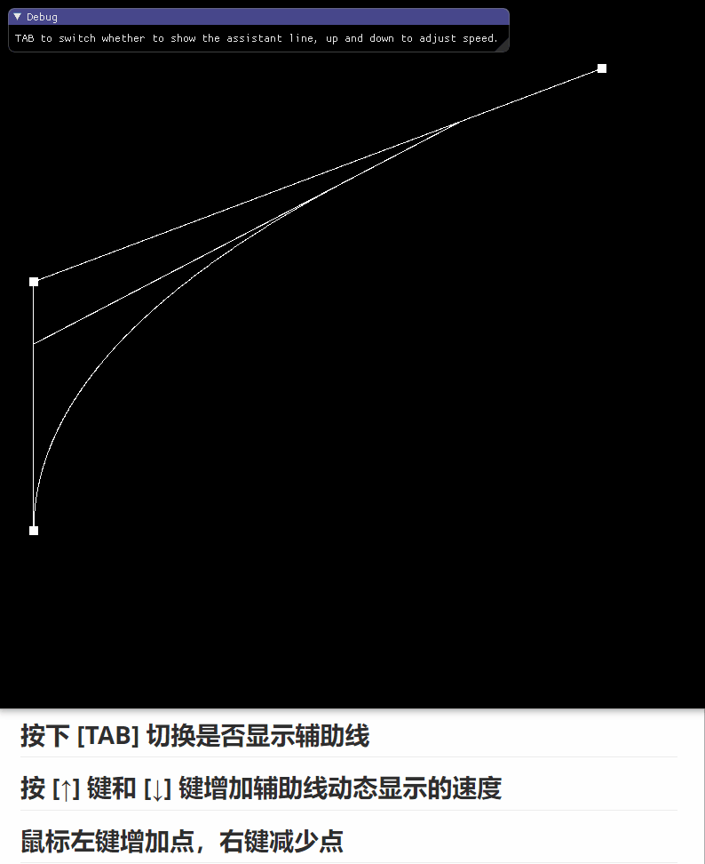

# Bezier 曲线 实验报告

## 实验结果

如图所示，支持使用键盘操作进行调整。

* 按下 `[TAB]`切换是否显示辅助线
* 按 **[&uarr;]** 键和 **[&darr;] **键增加辅助线动态显示的速度
* 鼠标左键增加控制点，右键减少控制点




## 实验原理

根据公式进行实现
$$
Q(t) = \sum_{i=0}^{n}P_iB_{i,n}(t), t\in [0,1] \\
B_{i,n}(t) = \frac {n!} {i!(n-i)!}t^i(1-t)^{n-i}
$$
核心代码如下

首先是 **B** 基函数:

```cpp
float bernstein(int i, int n, float t) {
	int tmp1 = 1, tmp2 = 1, tmp3 = 1;
	for (int j = i + 1; j <= n; j++) tmp1 *= j;
	for (int j = 1; j <= n - i; j++) tmp2 *= j;
	return ((float)tmp1 / (float)tmp2) * pow(t, i) * pow(1 - t, n - i);
}
```

这里对阶乘进行了一点优化, 将 $\frac{n!}{i!}$ 化简为了 $n\times (n-1) \times ... \times (i+1)$,减少了计算量.

然后是主体部分:

```cpp
// 任意阶的Bezier曲线
vector<float> genBezierCurvePoints(vector<Point> ps, float tLimit=1.0f) {
	int n = ps.size() - 1; // n + 1 个顶点
	//if (n>2) n = 2;
	vector<Point> points;

	for (float t = 0; t < tLimit; t += deltaT) {
		Point next(0, 0);
		for (int i = 0; i < n + 1; i++) { // 0 到 n 表示 n + 1 个顶点
			float param = bernstein(i, n, t);
			next.x += ps[i].x * param;
			next.y += ps[i].y * param;
		}
		points.push_back(next);
	}

	return pointsToFloat3(points);
}
```

`pointsToFloat3`函数将点映射到一个`float`数组上, 转换为OpenGL的VBO可以接受的形式.


