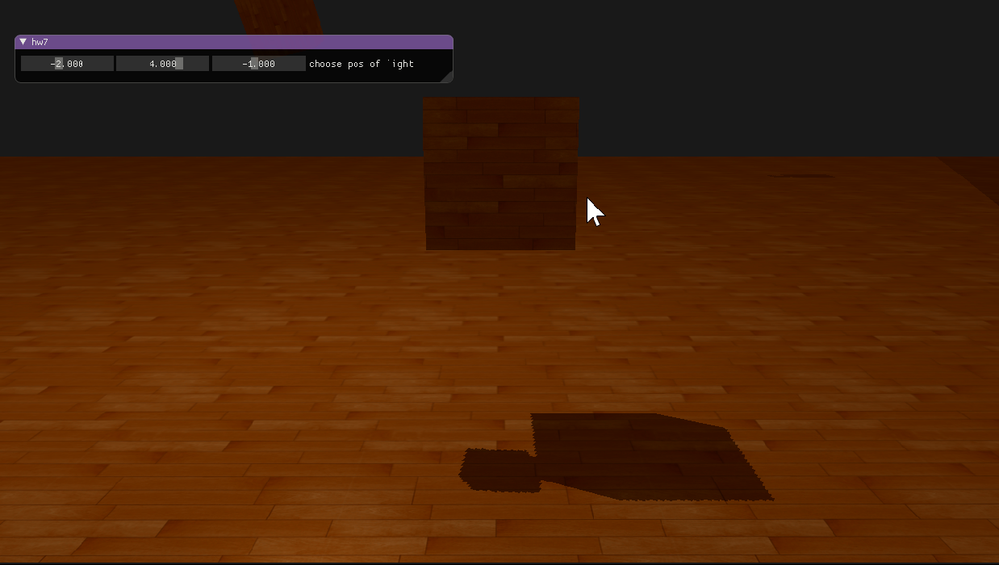

<h2>2019 CG Homework 7</h2>

# Homework 7 实验报告

*16340063 巩泽群*

## 实现效果

## Shadow mapping 原理概述

拿官网的图来说话，通过如图的方式，通过在目标绘制点和光源之间画一条线，如果之间有遮挡物那么就说明这个点应该被绘制为阴影，图中黑色的片段即需要被渲染为阴影的部分。

如果从目标点出发，计算这个黑色部分的值需要大量的计算。我们反其道而行之，从光源出发，记录每个光源映射到的点的“深度”值，这个深度值可以和 **z-buffer** 进行类比。这样，我们就可以为每一帧画面绘制出一个 **深度贴图**，这个深度贴图即代表了这个图中每个像素点是否应该被绘制出阴影效果。

